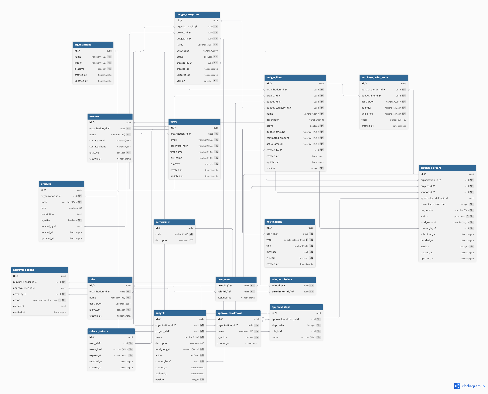

# Purchase Order & Budget Management System

A production-style full-stack application for managing organizations, projects, budgets, purchase orders, and configurable approval workflows.

Built as a technical assessment using Kotlin, Spring Boot, React, PostgreSQL, and Docker.

---

# Features

- JWT Authentication
- Role-Based Access Control (RBAC)
- Organization Management
- Project Management
- Budget Management
- Budget Categories
- Budget Lines
- Vendor Management
- Purchase Order Management
- Multi-level Approval Workflow
- PostgreSQL + Flyway Migrations
- Dockerized Full Stack
- REST API
- Swagger Documentation

---

# Tech Stack

| Layer          | Technology                  |
| -------------- | --------------------------- |
| Backend        | Kotlin + Spring Boot 3      |
| ORM            | Spring Data JPA + Hibernate |
| Authentication | JWT                         |
| Database       | PostgreSQL 16               |
| Migration      | Flyway                      |
| Frontend       | React + TypeScript + Vite   |
| Build          | Gradle                      |
| Infrastructure | Docker + Docker Compose     |

---

# Project Structure

```
purchase-order
│
├── backend
│   ├── src
│   ├── Dockerfile
│   └── build.gradle.kts
│
├── frontend
│   ├── src
│   ├── Dockerfile
│   └── package.json
│
├── database
│   └── migrations
│
├── docker-compose.yml
├── .env.example
└── README.md
```

---

# Requirements

Only one requirement is needed.

- Docker Desktop (Docker Compose v2)

No manual installation of the following is required:

- Java
- Gradle
- Node.js
- npm
- PostgreSQL

Everything runs inside Docker containers.

---

# Quick Start

Clone the repository

```bash
git clone <repository-url>

cd purchase-order
```

Copy environment variables

```bash
cp .env.example .env
```

Start everything

```bash
docker compose up --build
```

Docker automatically performs the following:

1. Starts PostgreSQL
2. Waits until PostgreSQL is healthy
3. Executes Flyway migrations
4. Seeds demo data
5. Starts Spring Boot Backend
6. Starts React Frontend

No additional setup is required.

---

# Application URLs

| Service    | URL                                         |
| ---------- | ------------------------------------------- |
| Frontend   | http://localhost:5173                       |
| Backend    | http://localhost:8080                       |
| REST API   | http://localhost:8080/api                   |
| Swagger UI | http://localhost:8080/swagger-ui/index.html |

---

# Reset Database

Delete all containers and database volume.

```bash
docker compose down -v
```

Start again

```bash
docker compose up --build
```

Flyway will recreate the schema and seed demo data automatically.

---

# Demo Accounts

Seeded automatically during Flyway migration.

| Role     | Email              | Password |
| -------- | ------------------ | -------- |
| Admin    | admin@acme.test    | password |
| Manager  | manager@acme.test  | password |
| Finance  | finance@acme.test  | password |
| Employee | employee@acme.test | password |

---

# ER Diagram



---

# Architecture

```
                +--------------------+
                |    React + Vite    |
                +---------+----------+
                          |
                    REST / JSON
                          |
                          ▼
               +----------------------+
               | Spring Boot Backend  |
               | Kotlin + JPA + JWT   |
               +----------+-----------+
                          |
                      Hibernate
                          |
                          ▼
                  PostgreSQL Database
                          ▲
                          |
                    Flyway Migration
```

---

# RBAC

The application uses a database-driven RBAC system.

Database tables:

- users
- roles
- permissions
- user_roles
- role_permissions

No roles are hardcoded inside the application.

Example roles:

- Admin
- Manager
- Finance
- Producer
- Employee

Permissions can easily be extended by inserting additional database records.

---

Employee
│
▼
Create Purchase Order
│
▼
Draft
│
▼
Submit
│
▼
Manager Approval
│
▼
Finance Approval
│
▼
Approved / Rejected

# Multi-Tenancy

Every business record belongs to an Organization.

Examples:

- Projects
- Budgets
- Vendors
- Purchase Orders

Service-layer authorization ensures users only access data belonging to their own organization.

---

# Notification System

The application includes a real-time notification system for important business events.

Features:

- Notification Bell
- Unread Notification Counter
- Notification Center
- Notification Popup
- Mark Notification as Read
- Automatic Polling
- Responsive Notification Dropdown

Notifications are generated for:

- Purchase Order Submitted
- Purchase Order Approved
- Purchase Order Rejected
- Budget Threshold Exceeded

# Vendor Management

The Vendor module provides:

- Create Vendor
- Update Vendor
- Delete Vendor
- View Vendors
- Organization-based Access Control

# Approval Workflow

Approval workflows are configurable.

Example:

```
Employee
      ↓
Manager
      ↓
Finance
      ↓
Producer
      ↓
Approved
```

Each approval action is recorded in the database for auditing purposes.

---

# Database

The database contains 18 normalized tables covering:

- Authentication
- Organizations
- Projects
- Vendors
- Budgets
- Purchase Orders
- Approval Workflow
- Notifications

Schema is managed entirely using Flyway.

---

# API Documentation

Swagger UI

```
http://localhost:8080/swagger-ui/index.html
```

---

# Design Decisions

## UUID Primary Keys

UUIDs are used instead of auto-increment IDs to support distributed systems and avoid exposing sequential identifiers.

---

## Flyway

Schema creation and seed data are version-controlled using Flyway.

This guarantees reproducible environments.

---

## Docker

The entire application runs through Docker Compose.

The examiner only needs to execute:

```bash
docker compose up --build
```

---

## Generated Columns

Budget calculations are implemented using PostgreSQL generated columns to ensure consistency.

---

## Optimistic Locking

Purchase Orders use optimistic locking with JPA `@Version`.

This prevents concurrent update conflicts.

---

# Assumptions

- One authenticated user belongs to one organization.
- Users may only access data within their organization.
- Approval workflows are organization-specific.
- Budget calculations are database-driven.

---

# Future Improvements

- Unit Tests
- Integration Tests
- CI/CD
- Audit Logging
- Email Notifications
- WebSocket Notifications
- File Attachments
- Purchase Order PDF Export

---

# Bonus Features

- Dockerized full stack
- JWT Authentication
- RBAC
- Flyway Migration
- Multi-tenancy
- Optimistic Locking
- Swagger API
- Responsive React UI

---

# Author

Adam Si Thu Thet Naing

Senior Software Engineer

Technical Assessment Submission
